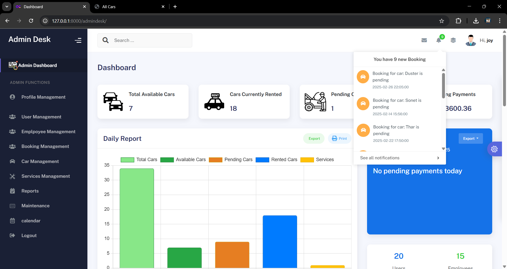
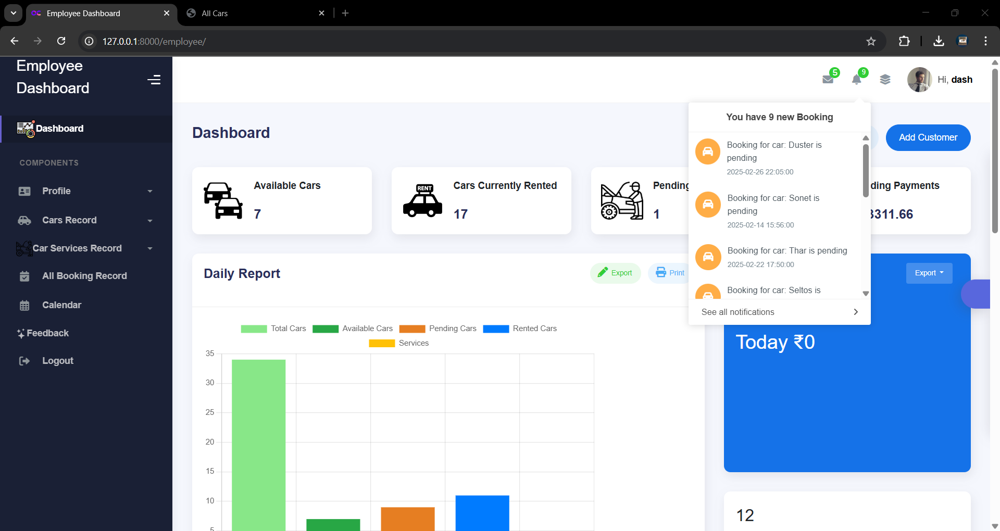

# 🚗 Car Rent Management System

A fully-featured **Car Rental Management System** built with **Django** that automates the end-to-end car rental process.  
It includes **role-based dashboards** for Admins, Employees, and Customers, real-time booking management, chat functionality, financial reports, and service tracking.

---

## 📌 Features

### **Admin Panel**
- Manage cars, categories, vendors, and customers
- Approve/reject bookings
- View **Service & Commission Reports** (with GST support)
- Real-time **chat with employees & vendors**
- Calendar-based booking overview
- Analytics dashboard

### **Employee Panel**
- Manage assigned bookings
- Chat with admins/vendors
- Update booking statuses
- View assigned tasks and schedules

### **Customer Panel**
- Browse available cars
- Book cars online
- View booking history and invoices
- Chat with support

---

## ⚙️ Technology Stack
- **Backend:** Django (Python)
- **Database:** SQLite (default Django DB)
- **Frontend:** Bootstrap, jQuery, AJAX
- **Task Queue:** Celery (for asynchronous tasks)
- **Message Broker:** Redis (for Celery communication)
- **Signals:** Django Signals (for real-time updates and notifications)

---

## 🔄 Celery, Redis & Django Signals

This project uses **Celery** with **Redis** as a message broker to handle asynchronous background tasks.  
**Django Signals** trigger Celery tasks whenever specific actions occur.

### **Use Cases in This Project**
1. **Booking Notifications**
   - When a **user books a car**, a signal triggers a Celery task to send:
     - Confirmation email to the **User**
     - New booking alert to the **Admin**
     - Task assignment email to the **Employee**

2. **Car Rent Request Form**
   - When a user **submits a rental request form**, Celery sends:
     - Acknowledgment email to the user
     - Notification email to the admin

3. **Chat Notifications**
   - If a new chat message is sent (Admin ↔ Employee ↔ Vendor), Celery sends an **instant email notification** to the recipient.

---

## 📸 Screenshots

### **Admin Dashboard**

### **Employee Dashboard**

### **Customer Dashboard**

---

## 🚀 Installation

1. **Clone the repository**
   
   git clone https://github.com/raoshreepal/Online-Car-Rent-Management-System.git
   cd car-rent-management
   

2. **Create a virtual environment**
   
   python -m venv venv
   source venv/bin/activate   # For Linux/Mac
   venv\Scripts\activate      # For Windows
   

3. **Install dependencies**
   
   pip install -r requirements.txt
   

4. **Apply migrations**
   
   python manage.py migrate
   

5. **Create a superuser**
   
   python manage.py createsuperuser
   

6. **Run the Django server**
   
   python manage.py runserver
   

---

## ⚙️ Start Redis & Celery

### **1️⃣ Start Redis Server**

# Linux/Mac
redis-server

# Windows (via Redis for Windows)
redis-server.exe

### **2️⃣ Start Celery Worker**

celery -A project_name worker --pool=solo -l info

*(Replace `project_name` with your Django project folder name)*

### **3️⃣ (Optional) Start Celery Beat for scheduled tasks**

celery -A project_name beat -l info

💡 Keep **Redis** and **Celery worker** running in separate terminal windows while your Django server is running.

---

## 🛠️ Usage
- Visit `http://127.0.0.1:8000/admin` → **Admin Panel**
- Visit `http://127.0.0.1:8000/employee` → **Employee Dashboard**
- Visit `http://127.0.0.1:8000/user` → **Customer Panel**

---

## 📜 License
This project is licensed under the **MIT License** - feel free to modify and use it as per your needs.

---

💡 **Note:**  
This project demonstrates **real-world Django features** like **Celery task queues**, **Redis message brokering**, **Django Signals**, and **role-based access control**.

